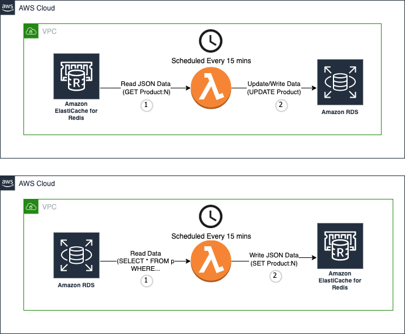

# Database and Cache Synchronization 

## Summary
This is a proof of concept to demostrate that you can run *StackExchange.Redis* .NET Core in Lambda Functions 
to connecting to Amazon ElastiCache and Amazon RDS and write the data from one source to another. 

## Architecture

We are going to run .NET Redis clients on AWS Lambda. The Lambda Function will be invoked by Amazon EventBridge on a schedule, say, every 15 minutes. During the invocation, the lambda function will read "watched" items, and copy the data from the database to cache. 



- Watched Items: Currently it is defined in the code. You can define the watched items in some external source, and read the set in the Lambda Function. 

- We use EntityFrameworkCore to read the data from the database. Records read from database will be worked as .NET objects. To store the data into Redis, we define "Product:<ID>" as the key and the value is the Serialized JSON string. 

### Reading data from Amazon ElastiCache and Overwrite data to Amazon RDS 

#### Before Invoking Lambda, QuantityInStock is 3000 in Database and 2000 in Redis
```
➜  psql -h $DB_ENDPIINT -U postgres -d postgres -c "SELECT * FROM \"Products\" WHERE  \"ProductId\" = 22"

 ProductId | ProductName |     Description      | QuantityInStock | Price 
-----------+-------------+----------------------+-----------------+-------
        22 | iPhone 13   | Your new superpower. |            3000 |   500
(1 row)
```
```
➜  redis-cli -h $REDIS_ENDPOINT -c GET "Product:22" | jq 
{
  "ProductId": 22,
  "ProductName": "iPhone 13",
  "Description": "Your new superpower.",
  "QuantityInStock": 2000,
  "Price": 500
}
```
#### Invoking Lambda 

The C# code snippet perform the tasks - read from database and write to redis
```
            {
                // Read record from database and save to cache
                var WriteToRedisTasks = new List<Task<bool>>();

                // Get the product objects to sync from the database 
                var items = db.Products.Where(b => firstRecordsToSyncIds.Contains(b.ProductId));

                // Write the data into Redis cache
                foreach (var item in items)
                {
                    WriteToRedisTasks.Add(
                        cache.StringSetAsync("Product:" + item.ProductId, JsonConvert.SerializeObject(item))
                    );
                    Console.WriteLine(String.Format("Write Product:{0} From Database to Redis", item.ProductId));
                }
                await Task.WhenAll(WriteToRedisTasks);

                db.ChangeTracker.Clear();

            }
```

Invoking the Lambda function...
```
Invocation result for arn:aws:lambda:us-west-2:091550601287:function:helloredis-app-HelloWorldFunction-SfgLy8RyVqVt
START RequestId: 3e6c3770-fa77-4b58-a762-ed397a25f696 Version: $LATEST
....
Write Product:20 from Redis to Database
Write Product:21 from Redis to Database
Write Product:22 from Redis to Database
Write Product:23 from Redis to Database
Write Product:24 from Redis to Database
Write Product:25 from Redis to Database
...
END RequestId: 3e6c3770-fa77-4b58-a762-ed397a25f696
```
#### After Invoking Lambda, QuantityInStock is 2000 in Database and Redis
```
➜  psql -h $DB_ENDPIINT -U postgres -d postgres -c "SELECT * FROM \"Products\" WHERE  \"ProductId\" = 22"

 ProductId | ProductName |     Description      | QuantityInStock | Price 
-----------+-------------+----------------------+-----------------+-------
        22 | iPhone 13   | Your new superpower. |            2000 |   500

```

### Reading data from Amazon RDS and Overwrite data to Amazon ElastiCache 

#### Before Invoking Lambda, Price is 400 in Database and 500 in Redis
```
➜  psql -h $DB_ENDPIINT -U postgres -d postgres -c "SELECT * FROM \"Products\" WHERE  \"ProductId\" = 11"

 ProductId | ProductName |     Description      | QuantityInStock | Price 
-----------+-------------+----------------------+-----------------+-------
        11 | iPhone 12   | Blast past fast.     |             100 |   400
(1 row)
```
```
➜  redis-cli -h $REDIS_ENDPOINT -c GET "Product:11" | jq 

{
  "ProductId": 11,
  "ProductName": "iPhone 12",
  "Description": "Blast past fast.",
  "QuantityInStock": 100,
  "Price": 500
}
```
#### Invoking Lambda 

The C# code snippet perform the tasks - read data from Redis and write to database

```
            {
                foreach (var recordId in secondRecordsToSyncIds)
                {
                    // Read data from Redis cache and convert to .NET Objects 
                    var ProductFromCache = JsonConvert.DeserializeObject<Product>(
                        await cache.StringGetAsync(String.Format("Product:{0}", recordId)));
                    // Update the datbase
                    db.Update(ProductFromCache);
                    Console.WriteLine(String.Format("Write Product:{0} from Redis to Database", ProductFromCache.ProductId));
                }

                // Save changes to the database
                var numOfRecordsUpdates = await db.SaveChangesAsync();
            }
  ```

```
Invocation result for arn:aws:lambda:us-west-2:091550601287:function:helloredis-app-HelloWorldFunction-SfgLy8RyVqVt

...
Write Product:12 From Database to Redis
Write Product:13 From Database to Redis
Write Product:14 From Database to Redis
Write Product:15 From Database to Redis
Write Product:16 From Database to Redis
Write Product:17 From Database to Redis
Write Product:18 From Database to Redis
Write Product:19 From Database to Redis
Write Product:11 From Database to Redis
...

```
#### After Invoking Lambda, Price is 400 in Redis
```
➜  redis-cli -h $REDIS_ENDPOINT -c GET "Product:11" | jq 

{
  "ProductId": 11,
  "ProductName": "iPhone 12",
  "Description": "Blast past fast.",
  "QuantityInStock": 100,
  "Price": 400
}

```

### Questions

#### 1. Why store the .NET Object as JSON String in Redis? 
- It is generic and easier to implement. It is possible to customize based on the business requirement. 
- For example, if `QuantityInStock` is updated very frequently, you can use Hash such as `"Product:12` with field name `QuantityInStock` so that doing decrement operations will be faster. 
- Using Hash in Redis is another option that can be considered. We need find libraries to read from Redis and convert it to a .NET object also it might not as fast as JSON strings.  
```
➜  redis-cli -h $REDIS_ENDPOINT -c HSET UsingHash:Product:12 ProductName 'iPhone 12' Description 'Blast past fast.' 'QuantityInStock' 100 Price 400

(integer) 4
➜  redis-cli -h $REDIS_ENDPOINT -c HGETALL UsingHash:Product:12

1) "ProductName"
2) "iPhone 12"
3) "Description"
4) "Blast past fast."
5) "QuantityInStock"
6) "100"
7) "Price"
8) "400"

➜  redis-cli -h $REDIS_ENDPOINT -c HINCRBY UsingHash:Product:12 QuantityInStock 100
(integer) 200
➜  redis-cli -h $REDIS_ENDPOINT -c HINCRBY UsingHash:Product:12 QuantityInStock 100
(integer) 300
➜  redis-cli -h $REDIS_ENDPOINT -c HINCRBY UsingHash:Product:12 QuantityInStock 100
redis-cli -h $REDIS_ENDPOINT -c HGET UsingHash:Product:12 QuantityInStock

(integer) 400
"400"
``` 

#### 2. Why call the Lambda function on every 15 min and the watched set instead of watching the changes on Redis and Database?  
- Watching the changes on the Redis: It is possible to use a long running Redis client using subscribe to PubSub channels. (
https://aws.amazon.com/tw/premiumsupport/knowledge-center/elasticache-redis-keyspace-notifications/)
- If we have one long running client to watch the Pub/Sub Channel, it is not reliable. If the client (or underlying infra) failed, the key space message from Redis is lost. To avoid missing the change, two or more long running clients will be required to subscribe.  
- Also it is more complex to track which items were modified and clear the item from the queue after writing back to Database. 
- On the other hand, it might not be desired for common use cases. For example, the `QuantityInStock` field for a popular item is updated 200 times per second. It is not reasonable to replay the 200 req/sec to database server. 
- If we don't accept stale or outdated data for any reason, the client should request data from redis - the authoritative data source (source of the record) instead using API call. 

#### 3. How about Detect Changes in Database?

- It is not possible to simply use audit trails in the database.
- For example, if `UPDATE Customers
SET ContactName = 'Alfred Schmidt', City= 'Frankfurt'
WHERE CustomerID = 1` it is possible. 
- On the other hand, `UPDATE Customers
SET ContactName='Juan'
WHERE Country='Mexico'` We don't know the primary keys to sync changes in cache.  

### Performance Considerations

- How about 1,000,000 records or more from cache to update in database? How to do parallel processing? 

### Other References 

[1] https://stackoverflow.com/questions/67564361/auto-syncing-for-keys-in-apache-geode
[2] https://github.com/VahidN/EFCoreSecondLevelCacheInterceptor
[3] https://docs.aws.amazon.com/dms/latest/userguide/CHAP_Target.Redis.html
[4] https://aws.amazon.com/blogs/database/replicate-your-data-from-amazon-aurora-mysql-to-amazon-elasticache-for-redis-using-aws-dms/

### TODO

It is possible to observe the latancy of Redis and Database Connection using OpenTelemetry.

### SAM CLI provided templates

The information below is provided by AWS SAM CLI. However in the proof of concept we are not using APIGateway or events, and the input is hard-code in the source. s 

supports Redis Cluster Mode Enabled.
supports reading data from Read Replicaas.
supports data types such as String, Hashes, Lists, Set, SortSet

This project contains source code and supporting files for a serverless application that you can deploy with the SAM CLI. It includes the following files and folders.

- src - Code for the application's Lambda function and Project Dockerfile.
- events - Invocation events that you can use to invoke the function.
- test - Unit tests for the application code. 
- template.yaml - A template that defines the application's AWS resources.

The application uses several AWS resources, including Lambda functions and an API Gateway API. These resources are defined in the `template.yaml` file in this project. You can update the template to add AWS resources through the same deployment process that updates your application code.

If you prefer to use an integrated development environment (IDE) to build and test your application, you can use the AWS Toolkit.  
The AWS Toolkit is an open source plug-in for popular IDEs that uses the SAM CLI to build and deploy serverless applications on AWS. The AWS Toolkit also adds a simplified step-through debugging experience for Lambda function code. See the following links to get started.

* [CLion](https://docs.aws.amazon.com/toolkit-for-jetbrains/latest/userguide/welcome.html)
* [GoLand](https://docs.aws.amazon.com/toolkit-for-jetbrains/latest/userguide/welcome.html)
* [IntelliJ](https://docs.aws.amazon.com/toolkit-for-jetbrains/latest/userguide/welcome.html)
* [WebStorm](https://docs.aws.amazon.com/toolkit-for-jetbrains/latest/userguide/welcome.html)
* [Rider](https://docs.aws.amazon.com/toolkit-for-jetbrains/latest/userguide/welcome.html)
* [PhpStorm](https://docs.aws.amazon.com/toolkit-for-jetbrains/latest/userguide/welcome.html)
* [PyCharm](https://docs.aws.amazon.com/toolkit-for-jetbrains/latest/userguide/welcome.html)
* [RubyMine](https://docs.aws.amazon.com/toolkit-for-jetbrains/latest/userguide/welcome.html)
* [DataGrip](https://docs.aws.amazon.com/toolkit-for-jetbrains/latest/userguide/welcome.html)
* [VS Code](https://docs.aws.amazon.com/toolkit-for-vscode/latest/userguide/welcome.html)
* [Visual Studio](https://docs.aws.amazon.com/toolkit-for-visual-studio/latest/user-guide/welcome.html)

## Deploy the sample application

The Serverless Application Model Command Line Interface (SAM CLI) is an extension of the AWS CLI that adds functionality for building and testing Lambda applications. It uses Docker to run your functions in an Amazon Linux environment that matches Lambda. It can also emulate your application's build environment and API.

To use the SAM CLI, you need the following tools.

* SAM CLI - [Install the SAM CLI](https://docs.aws.amazon.com/serverless-application-model/latest/developerguide/serverless-sam-cli-install.html)
* Docker - [Install Docker community edition](https://hub.docker.com/search/?type=edition&offering=community)

You may need the following for local testing.
* .NET Core - [Install .NET Core](https://www.microsoft.com/net/download)

To build and deploy your application for the first time, run the following in your shell:

```bash
sam build
sam deploy --guided
```

The first command will build a docker image from a Dockerfile and then copy the source of your application inside the Docker image. The second command will package and deploy your application to AWS, with a series of prompts:

* **Stack Name**: The name of the stack to deploy to CloudFormation. This should be unique to your account and region, and a good starting point would be something matching your project name.
* **AWS Region**: The AWS region you want to deploy your app to.
* **Confirm changes before deploy**: If set to yes, any change sets will be shown to you before execution for manual review. If set to no, the AWS SAM CLI will automatically deploy application changes.
* **Allow SAM CLI IAM role creation**: Many AWS SAM templates, including this example, create AWS IAM roles required for the AWS Lambda function(s) included to access AWS services. By default, these are scoped down to minimum required permissions. To deploy an AWS CloudFormation stack which creates or modifies IAM roles, the `CAPABILITY_IAM` value for `capabilities` must be provided. If permission isn't provided through this prompt, to deploy this example you must explicitly pass `--capabilities CAPABILITY_IAM` to the `sam deploy` command.
* **Save arguments to samconfig.toml**: If set to yes, your choices will be saved to a configuration file inside the project, so that in the future you can just re-run `sam deploy` without parameters to deploy changes to your application.

You can find your API Gateway Endpoint URL in the output values displayed after deployment.

## Use the SAM CLI to build and test locally

Build your application with the `sam build` command.

```bash
hello-redis$ sam build
```

The SAM CLI builds a docker image from a Dockerfile and then installs dependencies defined in `src/HelloWorld.csproj` inside the docker image. The processed template file is saved in the `.aws-sam/build` folder.

Test a single function by invoking it directly with a test event. An event is a JSON document that represents the input that the function receives from the event source. Test events are included in the `events` folder in this project.

Run functions locally and invoke them with the `sam local invoke` command.

```bash
hello-redis$ sam local invoke HelloWorldFunction --event events/event.json
```

The SAM CLI can also emulate your application's API. Use the `sam local start-api` to run the API locally on port 3000.

```bash
hello-redis$ sam local start-api
hello-redis$ curl http://localhost:3000/
```

The SAM CLI reads the application template to determine the API's routes and the functions that they invoke. The `Events` property on each function's definition includes the route and method for each path.

```yaml
      Events:
        HelloWorld:
          Type: Api
          Properties:
            Path: /hello
            Method: get
```

## Add a resource to your application
The application template uses AWS Serverless Application Model (AWS SAM) to define application resources. AWS SAM is an extension of AWS CloudFormation with a simpler syntax for configuring common serverless application resources such as functions, triggers, and APIs. For resources not included in [the SAM specification](https://github.com/awslabs/serverless-application-model/blob/master/versions/2016-10-31.md), you can use standard [AWS CloudFormation](https://docs.aws.amazon.com/AWSCloudFormation/latest/UserGuide/aws-template-resource-type-ref.html) resource types.

## Fetch, tail, and filter Lambda function logs

To simplify troubleshooting, SAM CLI has a command called `sam logs`. `sam logs` lets you fetch logs generated by your deployed Lambda function from the command line. In addition to printing the logs on the terminal, this command has several nifty features to help you quickly find the bug.

`NOTE`: This command works for all AWS Lambda functions; not just the ones you deploy using SAM.

```bash
hello-redis$ sam logs -n HelloWorldFunction --stack-name hello-redis --tail
```

You can find more information and examples about filtering Lambda function logs in the [SAM CLI Documentation](https://docs.aws.amazon.com/serverless-application-model/latest/developerguide/serverless-sam-cli-logging.html).

## Unit tests

Tests are defined in the `test` folder in this project.

```bash
hello-redis$ dotnet test test/HelloWorld.Test
```

## Cleanup

To delete the sample application that you created, use the AWS CLI. Assuming you used your project name for the stack name, you can run the following:

```bash
aws cloudformation delete-stack --stack-name hello-redis
```

## Resources

See the [AWS SAM developer guide](https://docs.aws.amazon.com/serverless-application-model/latest/developerguide/what-is-sam.html) for an introduction to SAM specification, the SAM CLI, and serverless application concepts.

Next, you can use AWS Serverless Application Repository to deploy ready to use Apps that go beyond hello world samples and learn how authors developed their applications: [AWS Serverless Application Repository main page](https://aws.amazon.com/serverless/serverlessrepo/)
